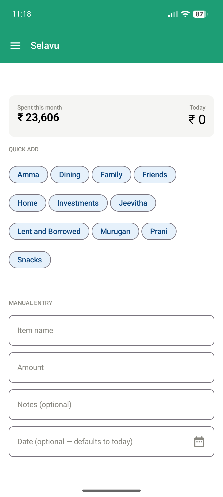
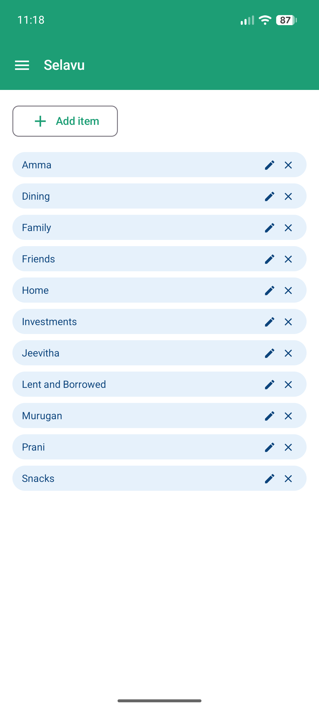
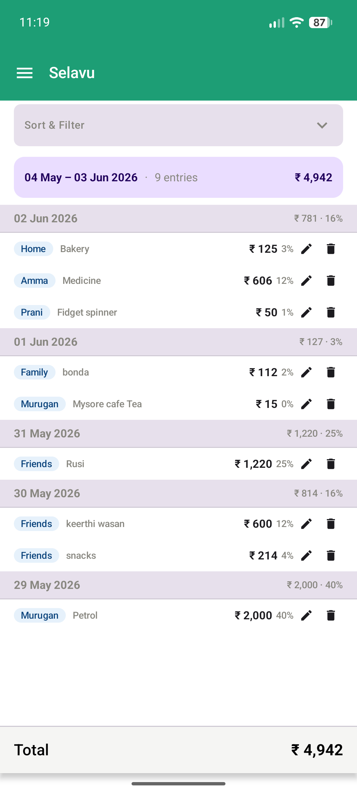
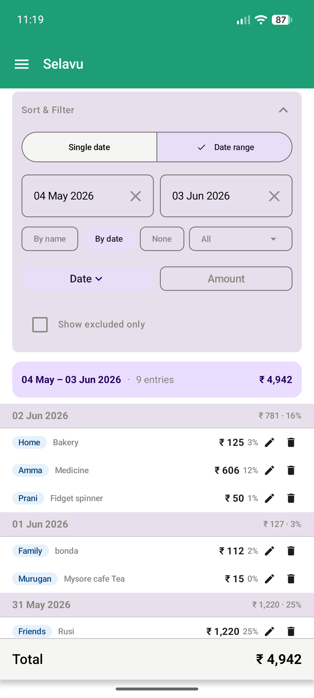
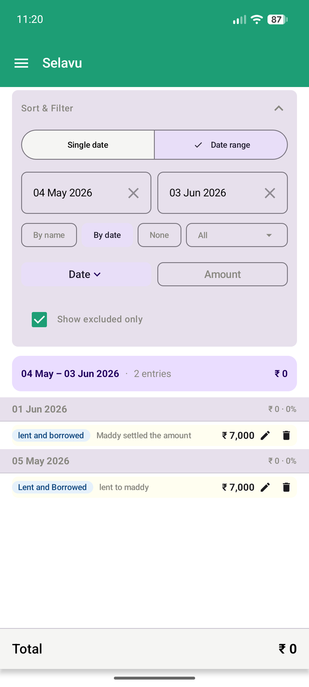
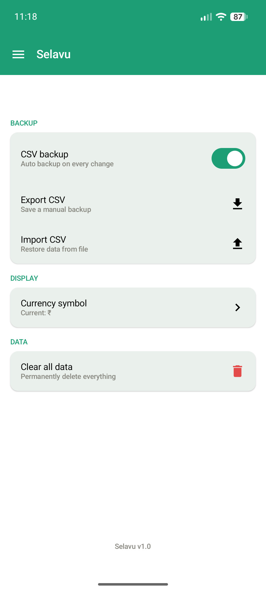

# 💰 Selavu — Private Offline Expense Tracker

Selavu is a lightweight, offline-first expense tracking app built with Kotlin + Jetpack Compose. Designed for personal finance management, it runs entirely on-device with no internet required.

<p align="center">
<a href="screenshots/selavu_home.png"></a>
<a href="screenshots/selavu_item_names.png"></a>
<a href="screenshots/selavu_ledger.png"></a>
<a href="screenshots/selavu_ledger_filter.png"></a>
<a href="screenshots/selavu_ledger_excluded_list.png"></a>
<a href="screenshots/selavu_settings.png"></a>
</p>

---

## ✨ Features

- **Fast expense entry** — Save expenses in under 3 seconds with quick-add chips
- **Fully offline** — Room database (SQLite), no cloud or internet required
- **Saved items** — Quick-add chips for frequently used expense categories
- **Ledger with powerful filtering** — Sort, filter, group expenses by date or category
- **Inline editing** — Edit expenses directly in the ledger without leaving the page
- **Notes field** — Add optional notes to each expense (max 50 chars)
- **CSV backup** — Auto-sync on every transaction + manual import/export
- **Private & secure** — No accounts, no tracking, data stays on your device
- **Minimal UI** — Clean, frictionless Material 3 design

## 🏗️ Architecture

```
MVVM + Repository Pattern
├── UI Layer → Jetpack Compose (Material 3)
├── ViewModel → StateFlow, business logic
├── Repository → Data operations
├── Database → Room (SQLite)
└── Services → CSV backup manager
```

## 📥 Quick Install

Download the APK from the [Releases](https://github.com/humorouslydistracted/selavu/releases) page and install on your Android device.

## 🚀 Building from Source

### Prerequisites
- Android Studio Hedgehog (2023.1.1) or later
- JDK 17 or later
- Android SDK 34+

### Clone & Build
```bash
git clone https://github.com/humorouslydistracted/selavu.git
cd selavu
./gradlew assembleDebug
```

### Install on Device
```bash
adb install app/build/outputs/apk/debug/app-debug.apk
```

## 📂 Database Schema

Two tables:
- **items** — Saved expense categories
- **expenses** — Individual expense records with item links

CSV columns: `id, item_name, item_id, amount, date, created_at, notes`

## 🔐 Validation Rules

- Item names: letters, numbers, space, `.`, `,`, `'`, `-` (no special chars)
- Notes: max 50 characters, alphanumeric plus `.`, `,`, `'`, `"`, `-`, `@`, `:`, `!`, `=`
- Amount: positive numbers only
- Date: optional (defaults to today)
- "Others" reserved word (expense type for unsaved entries)

## 📄 License

This project is private and proprietary.

## 📝 Changelog

### v1.0.0 — May 31, 2026
- Initial release
- Fast expense entry with quick-add chips
- Ledger with date/category filtering and grouping
- CSV auto-backup on every transaction
- Notes field for expenses
- Offline-first architecture
